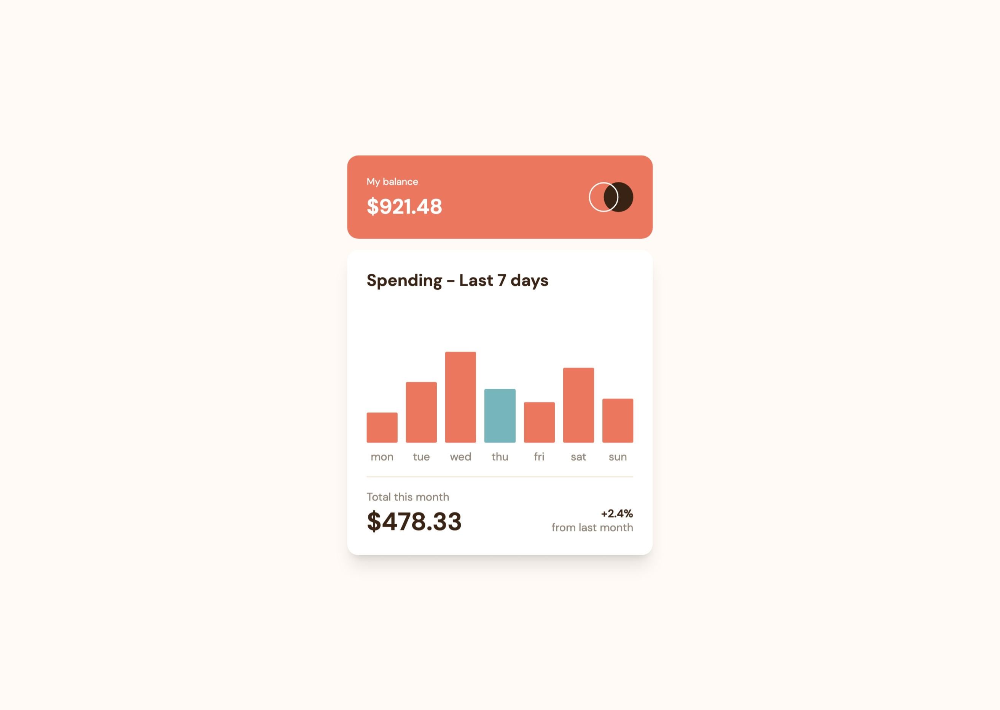
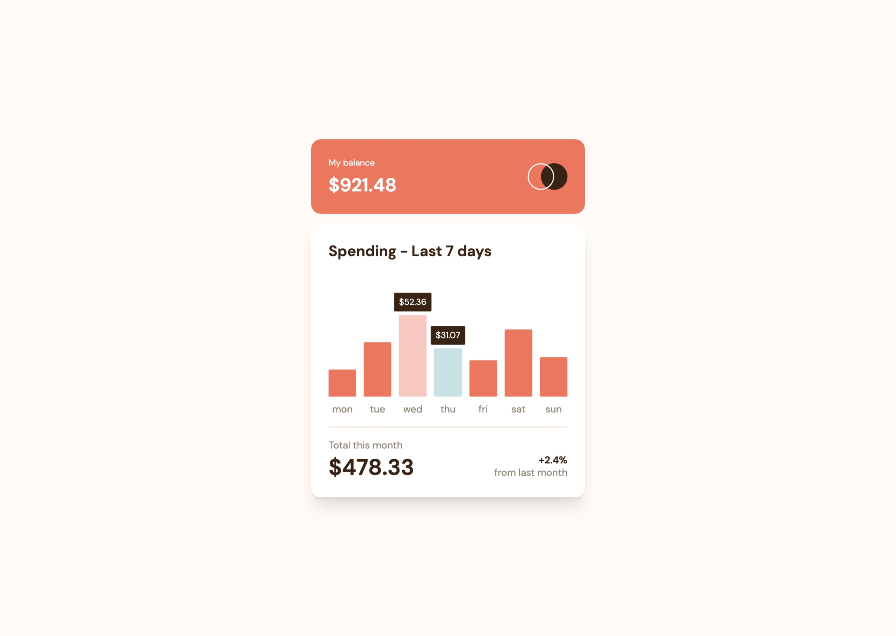

# Frontend Mentor - Expenses chart component solution

This is a solution to the [Expenses chart component challenge on Frontend Mentor](https://www.frontendmentor.io/challenges/expenses-chart-component-e7yJBUdjwt). Frontend Mentor challenges help you improve your coding skills by building realistic projects.

## Table of contents

- [Overview](#overview)
  - [The challenge](#the-challenge)
  - [Screenshot](#screenshot)
  - [Links](#links)
- [My process](#my-process)
  - [Built with](#built-with)
  - [What I learned](#what-i-learned)
- [Author](#author)

## Overview

### The challenge

Users should be able to:

- [x] View the bar chart and hover over the individual bars to see the correct amounts for each day
- [x] See the current day’s bar highlighted in a different colour to the other bars
- [x] View the optimal layout for the content depending on their device’s screen size
- [x] See hover states for all interactive elements on the page
- [x] **Bonus**: Use the JSON data file provided to dynamically size the bars on the chart

### Screenshot




### Links

- Solution URL: [Add solution URL here](https://your-solution-url.com)
- Live Site URL: [Add live site URL here](https://your-live-site-url.com)

## My process

### Built with

- [React](https://reactjs.org/) - JS library
- [Tailwindcss](https://tailwindcss.com/) - For styles

### What I learned

Center an absolute positioned element

```html
<div className="absolute left-1/2 -translate-x-1/2 ...">...</div>
```

## Author

- Frontend Mentor - [@agusthas](https://www.frontendmentor.io/profile/agusthas)
- Twitter - [@agusthas](https://www.twitter.com/agusthas)
